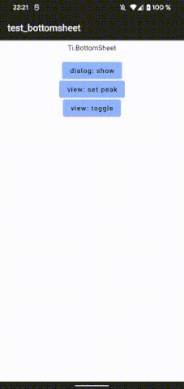

# Ti.BottomSheet & Ti.BottomSheetDialog for Android

<br/>

for the iOS version have a look here: [ti.bottomsheetcontroller-ios](https://github.com/mbender74/ti.bottomsheetcontroller-ios).

__work in progress__ methods/properties/events might change before the first release.


## Example

```xml
<BottomSheet id="bs" module="ti.bottomsheet">
  <!-- add your content -->
</BottomSheet>

<BottomSheetDialog id="bsd" module="ti.bottomsheet">
  <!-- add your content -->
</BottomSheetDialog>
```


```js
$.bs.open();
$.bsd.open();
```

## BottomSheet

Can be used for a peaking view at the bottom that can be extended.

### Methods

* show() or open()
* hide()
* toggle()
* add()

### Properties

* peakHeight
* dimAmount (dialog only, creation only)

### Events
* open
* close
* stateChanged: e.state (see Constants)

### Constants

* BottomSheet.STATE_DRAGGING
* BottomSheet.STATE_SLIDING
* BottomSheet.STATE_OPEN
* BottomSheet.STATE_PEAK
* BottomSheet.STATE_CLOSE


---
## BottomSheetDialog

The dialog version will dimm the background when it is shown.

### Methods

* show() or open()
* hide() or close()
* add()

### Properties

* backgroundColor
* borderRadius
* cancelable
* peakHeight

### Events

* dismissed
* open
* close
* stateChanged: e.state (see Constants)
* peak

### Constants

* BottomSheet.STATE_DRAGGING
* BottomSheet.STATE_SLIDING
* BottomSheet.STATE_OPEN
* BottomSheet.STATE_PEAK
* BottomSheet.STATE_CLOSE
